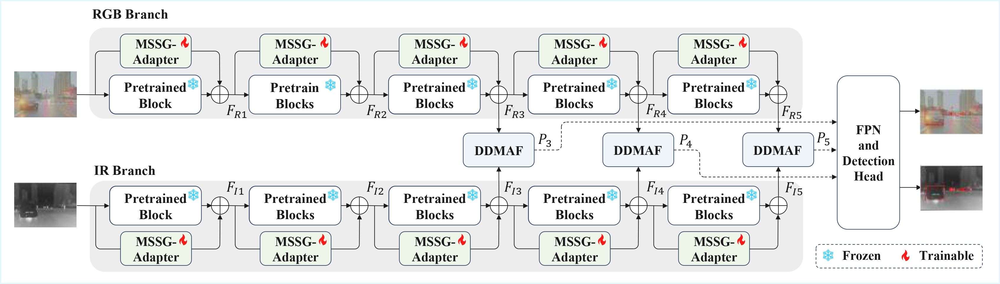

# SGD2Net
This repository contains the implementation of the following paper:
> **Sparse Gain Adaptation with Dual-Domain Fusion Network for Multimodal Object Detection**

## Overview

Multimodal object detection that integrates the complementary information from visible and infrared inputs is a mainstream strategy for achieving robust all-day perception. However, prevailing methods are often constrained by high training costs and insufficient exploitation of the intrinsic complementary characteristics between visible and infrared modalities.
To address these issues, we propose a parameter-efficient multimodal detection framework integrating sparse gain adaptation and dual-domain modality-aware fusion. To maintain pretrained representations while minimizing training costs, we introduce a multi-scale sparse gain adapter, which injects sparse gains into frozen backbones via multi-scale dilated convolutions, achieving effective adaptation with minimal trainable parameters. 
Furthermore, we develop a dual-domain modality-aware fusion module to explicitly model modality-complementary characteristics across frequency and spatial domains. 
Specifically, a frequency-decoupled cross-modal fusion block applies dedicated discrete cosine transform basis subsets to modulate modality-specific spectral components. It enhances complementary frequency characteristics, where infrared features emphasize low-frequency structural cues while visible features retain high-frequency textural details. The frequency-enhanced representations are then used to learn channel attention weights, which adaptively fuse the two modalities into a unified feature space.
Building upon this, a modality-aware spatial attentive fusion block further learns spatially adaptive attention maps to emphasize informative regions and promote complementary aggregation across modalities. 
Extensive experiments on three public benchmarks demonstrate that our method consistently outperforms state-of-the-art multimodal detectors, requiring only 1.2M trainable parameters, which validates its superior detection performance and remarkable parameter efficiency.

## TodoList

- [x] Release model code
- [ ] Release training and testing code
- [ ] model weights

## Prerequisites

To get started, first please clone the repo
```
git clone https://github.com/boyawei1115/SGD2Net.git
```
Then, please run the following commands:
```
conda create -n SGD2Net python=3.8.20
conda activate SGD2Net
pip install -r requirements.txt
```
